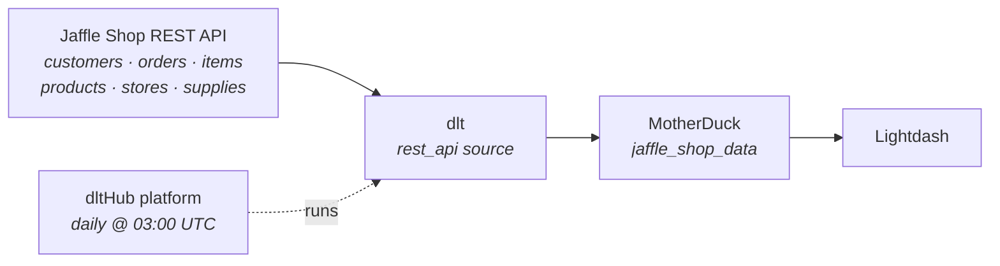

# Jaffle Shop → MotherDuck → Lightdash

**From an empty folder to a scheduled production pipeline with a dashboard — by typing four sentences to an AI agent.**

We load the [dltHub Jaffle Shop API](https://jaffle-shop.dlthub.com/docs) (a fictional toasted-sandwich chain — ~154,000 rows across six endpoints) into **MotherDuck**, deploy it to the **dltHub platform** on a daily schedule, and chart it in **Lightdash**.

You will not write the pipeline. You will *ask for it.*



---

## The whole demo

```bash
uvx dlthub-init@latest jaffle-shop && cd jaffle-shop
claude
```

That's the only shell you touch (plus `dlthub login` before deploying — it needs a browser). **No toolkit installs, no `dlt` commands, no `pip`.** `dlthub-init` ships the `dlthub-router` skill, and the router pulls in whatever toolkit each request needs, when it needs it.

Then, four prompts — the actual sequence that produced this repo:

| # | What you type into Claude | What comes back |
|---|---------------------------|-----------------|
| 1 | `load data from https://jaffle-shop.dlthub.com/docs to motherduck` | a working `rest_api` pipeline, credentials wired up |
| 2 | `token is set, run it` | ~154k rows in MotherDuck, verified against the API |
| 3 | `deploy the pipeline` | running on the dltHub platform |
| 4 | `schedule it daily` | a cron trigger|

**Prerequisites:** [`uv`](https://docs.astral.sh/uv/) + Python 3.10+, [Claude Code](https://claude.com/claude-code), a [MotherDuck](https://app.motherduck.com/) token, a [dltHub](https://app.dlthub.com/) account, and [Lightdash](https://app.lightdash.cloud/) for step 7. **The data itself needs no API key** — the Jaffle Shop API is public.

---

## Step 0 — What `dlthub-init` gives you

A `uv` project with `dlt[hub]` and — the important part — the **AI harness**:

- **Rules** — always in context: *never read `secrets.toml`, always run from the project root.*
- **Skills** — named workflows: `find-source` → `create-rest-api-pipeline` → `debug-pipeline` → `validate-data` → `setup-runtime` → `prepare-deployment` → `deploy-workspace`. The agent follows the path instead of inventing one.
- **`dlthub-router`** — reads your intent and installs the right toolkit on demand.
- **MCP tools** — list tables, preview rows, check row counts, view *redacted* secrets. It can verify a token exists without ever seeing it.

Without this, an agent guesses at API shapes and hallucinates dlt syntax. With it, it doesn't.

📖 [AI Harness](https://dlthub.com/docs/hub/ai-harness/introduction)

---

## Step 1 — `load data from ... to motherduck`

You gave it a docs URL and a destination name. The agent:

**Routes itself.** The router maps *ingest from a REST API* → `rest-api-pipeline` toolkit, installs it, enters at `find-source`.

**Reads the API instead of guessing.** It fetches `https://jaffle-shop.dlthub.com/openapi.json` and finds six endpoints:

| Endpoint | Fields | Rows |
|----------|--------|-----:|
| `/customers` | `id`, `name` | 935 |
| `/orders` | `id`, `customer_id`, `store_id`, `ordered_at`, `subtotal`, `tax_paid`, `order_total`, `items[]` | 61,948 |
| `/items` | `id`, `order_id`, `sku` | 90,900 |
| `/products` | `sku`, `name`, `type`, `price`, `description` | 10 |
| `/stores` | `id`, `name`, `opened_at`, `tax_rate` | 6 |
| `/supplies` | `id`, `name`, `cost`, `perishable`, `sku` | 65 |

It also finds `/api/v1/row-counts`, which reports the true size of every table — that becomes the **verification oracle** in step 2, the difference between "the pipeline ran" and "the pipeline is correct."

Then it probes what the spec doesn't say and finds the pagination mechanism in a response header: `link: </api/v1/customers?page_size=100&page=2>; rel="next"`.

**Writes the pipeline** — `rest_api_pipeline.py`, the file in this repo:

```python
@dlt.source(name="jaffle_shop")
def jaffle_shop_source(base_url: str = "https://jaffle-shop.dlthub.com/api/v1/", page_size: int = 100):
    config: RESTAPIConfig = {
        "client": {
            "base_url": base_url,
            # The API signals the next page with a `Link` header (rel="next")
            "paginator": "header_link",
        },
        "resource_defaults": {
            "primary_key": "id",
            "write_disposition": "replace",
            "endpoint": {"params": {"page_size": page_size}},
        },
        "resources": [
            {"name": "customers", "endpoint": {"path": "customers"}},
        ],
    }
    yield from rest_api_resources(config)


def load_jaffle_shop() -> None:
    pipeline = dlt.pipeline(
        pipeline_name="jaffle_shop",
        destination="motherduck",
        dataset_name="jaffle_shop_data",
    )
    print(pipeline.run(jaffle_shop_source()))


if __name__ == "__main__":
    load_jaffle_shop()
```

### 🎓 Three important things 

1. **One endpoint first, deliberately.** The skill builds the simplest thing that loads. When something breaks you want one variable, not six.
2. **Pagination is one word.** `"paginator": "header_link"` is the entire implementation.
3. **No schema anywhere.** No `CREATE TABLE`, no types. dlt infers all of it and [evolves it](https://dlthub.com/docs/general-usage/schema-evolution) when the API changes.

**Credentials.** MotherDuck needs a token, and the agent operates under a hard rule: *never read `secrets.toml`, never echo a secret.* So it tells you where to put it and stops:

```toml
# .dlt/secrets.toml — gitignored, never committed
[destination.motherduck.credentials]
database = "jaffle_demo"
password = "<your MotherDuck access token>"
```

> 🔒 if a token lands in a chat window, it is compromised — rotate it.

---

## Step 2 — `token is set, run it`

The agent runs it and reads its own output (`debug-pipeline`). A dlt run is always **extract** (page the API to disk) → **normalize** (infer types, unnest lists, write Parquet) → **load** (create tables, load them).

### 🎓 The best moment: it fails

For example, the agent had reached for a page-number paginator, and `PageNumberPaginator.total_path` defaults to `"total"`, a field this API doesn't return. It pulled the trace and the load package, read the traceback, switched to `header_link` (which the `Link` header had been advertising all along), and re-ran. Green.

### Verification, not vibes

The agent compares what landed against `/row-counts`: **935 customers, 61,948 orders, 90,900 items, 10 products, 6 stores, 65 supplies — 153,864 rows, all matching.** Full load ~2m30s; ~15s with `.add_limit(1)` while iterating.

📖 [How dlt works](https://dlthub.com/docs/reference/explainers/how-dlt-works) · [Destination tables & lineage](https://dlthub.com/docs/general-usage/destination-tables)

---

## Step 3 — `deploy the pipeline`

The router pulls in `dlthub-platform` and walks `setup-runtime` → `prepare-deployment` → `deploy-workspace`. Nothing for you to install.

**It adds decorator** `@run.pipeline("github_api")`.

**It registers the job** in `__deployment__.py`:

```python
from rest_api_pipeline import load_jaffle_shop
__all__ = ["load_jaffle_shop"]
```

**Then it ships it,** narrating each step: dry-run the plan → **stops for your approval** → sync the manifest (~5s) → simulate the run locally under the `prod` profile → launch on the cloud and stream logs → open the web UI.

> 🔑 **The one thing the agent can't do for you:** `dlthub login` opens a browser OAuth flow. Just follow the instructions.

📖 [Deployments](https://dlthub.com/docs/hub/pipeline-operations/deployments) · [Monitoring](https://dlthub.com/docs/hub/pipeline-operations/monitoring)

---

## Step 4 — `schedule it daily`

**There is no CLI command to add a schedule.** The decorator is the source of truth, so the agent edits it and re-deploys; the deploy reconciles everything (new jobs added, removed jobs archived).

```python
@run.pipeline("jaffle_shop", trigger=trigger.schedule("0 3 * * *"))
```

Also: `trigger.every("6h")`, `trigger.once("2026-12-31T23:59:59Z")`, `trigger=other_job.success`.

📖 [Triggers and scheduling](https://dlthub.com/docs/hub/pipeline-operations/triggers)

---

## Step 5 — Keep going, still by prompting

**`add the remaining endpoints: orders, items, products, stores, supplies`** → the agent uses `new-endpoint` and gets the keys right:

```python
{"name": "products", "primary_key": "sku",          "endpoint": {"path": "products"}},   # no `id` field at all
{"name": "supplies", "primary_key": ["id", "sku"],  "endpoint": {"path": "supplies"}},   # `id` is NOT unique
```
**`make orders incremental on ordered_at`** → `/orders` accepts `start_date`/`end_date`, so it's built for this:

```python
"params": {"start_date": {"type": "incremental", "cursor_path": "ordered_at", "initial_value": "2016-09-01"}}
```

Other prompts worth trying: `show me the data` · `does the loaded data look right?` · `add data quality checks on orders` · `the pipeline is slow, speed it up` · `build me a notebook with charts` · `notify me in Slack when the job fails`.

📖 [Incremental loading](https://dlthub.com/docs/general-usage/incremental-loading) · [Merge loading](https://dlthub.com/docs/general-usage/merge-loading)

---

## Step 6 — Look at the data in MotherDuck

Open [app.motherduck.com](https://app.motherduck.com/) and the tables are already there, under the database from your `secrets.toml` → schema **`jaffle_shop_data`**. The dlt `dataset_name` *is* the MotherDuck schema — that's the whole mapping.

> 🎓 **Why MotherDuck for a demo like this.** It's DuckDB in the cloud, so the SQL you wrote against a local `.duckdb` file works unchanged against the shared warehouse — the dev → prod switch is a *credential* change, not a rewrite. Loads are fast (154k rows in ~2m30s over the network), there's nothing to provision, and it's what Lightdash connects to in step 7.

Results below come from an actual full load — nothing here is illustrative.

```sql
select s.name as store,
       count(*) as orders,
       round(sum(o.order_total) / 100.0, 2) as revenue_usd  -- the API returns cents
from jaffle_shop_data.orders o
join jaffle_shop_data.stores s on o.store_id = s.id
group by 1 order by 3 desc;
```

| store | orders | revenue_usd |
|-------|-------:|------------:|
| Philadelphia | 39,931 | 450,969.65 |
| Brooklyn | 22,017 | 220,455.72 |

> 🎓 Six stores exist in `stores`, but only **two** appear in `orders`. A join that quietly drops four dimension rows is exactly what students should learn to notice *before* it reaches a dashboard.

The dataset covers **2016-09-01 → 2017-08-31**: 61,948 orders, **$671,425.37** total, **$10.84** average order. Top sellers are all beverages (`for richer or pourover`, 14,325 units).

**Query it from anywhere.** MotherDuck is reachable with an `md:` connection string — from Python, from the DuckDB CLI, or attached to a local DuckDB session:

```python
import duckdb
con = duckdb.connect("md:jaffle_demo")            # or duckdb.connect("md:") to pick a database
con.sql("select count(*) from jaffle_shop_data.orders").show()
```

Or through dlt, which already knows the destination and dataset:

```python
import dlt
dataset = dlt.attach("jaffle_shop").dataset()
print(dataset.customers.df().head())
print(dataset("select count(*) from orders").df())
```

📖 [Access datasets in Python](https://dlthub.com/docs/general-usage/dataset-access/dataset)

---

## Step 7 — Lightdash

Lightdash builds its semantic layer from a **dbt project** and reaches MotherDuck through its **DuckDB connector in MotherDuck mode** (requires dbt **1.8+**).

**Connect:** Settings → Project → Warehouse connection → DuckDB → MotherDuck mode → your token, your database, schema `jaffle_shop_data`.

**Model** — fix the cents problem once, for everyone:

```sql
-- models/fct_orders.sql
select o.id as order_id, o.customer_id, s.name as store_name, o.ordered_at,
       o.subtotal/100.0 as subtotal_usd, o.order_total/100.0 as order_total_usd
from {{ source('jaffle_shop_data', 'orders') }} o
left join {{ source('jaffle_shop_data', 'stores') }} s on o.store_id = s.id
```

```yaml
# models/fct_orders.yml — Lightdash reads metrics from here
models:
  - name: fct_orders
    meta: {primary_key: order_id}
    columns:
      - name: order_total_usd
        meta:
          metrics:
            total_revenue: {type: sum}
            average_order_value: {type: average}
```

**Charts worth building live:** revenue by month · revenue by store (and the four missing ones) · average order value as a big number · best sellers · jaffles vs beverages.

📖 [Connect a project](https://docs.lightdash.com/get-started/setup-lightdash/connect-project) · [Metrics](https://docs.lightdash.com/references/metrics)

**Prefer to stay in Python?** dltHub can [generate the dbt models](https://dlthub.com/docs/hub/transformations/dbt-transformations) and deploy [marimo notebooks or Streamlit apps](https://dlthub.com/docs/hub/cookbook/build-streamlit-dashboard) — no BI tool required.


## Links

**This demo** — [Jaffle Shop API docs](https://jaffle-shop.dlthub.com/docs) 
**dlt** — [Introduction](https://dlthub.com/docs/intro) · [How dlt works](https://dlthub.com/docs/reference/explainers/how-dlt-works) · [REST API source](https://dlthub.com/docs/dlt-ecosystem/verified-sources/rest_api/basic) · [REST API tutorial](https://dlthub.com/docs/tutorial/rest-api) · [Incremental](https://dlthub.com/docs/general-usage/incremental-loading) · [Merge](https://dlthub.com/docs/general-usage/merge-loading) · [Schema evolution](https://dlthub.com/docs/general-usage/schema-evolution) · [Credentials](https://dlthub.com/docs/general-usage/credentials) · [MotherDuck destination](https://dlthub.com/docs/dlt-ecosystem/destinations/motherduck) · [Docs index for LLMs](https://dlthub.com/docs/llms.txt)

**dltHub platform** — [Introduction](https://dlthub.com/docs/hub/getting-started/introduction) · [AI Harness](https://dlthub.com/docs/hub/ai-harness/introduction) · [Toolkits](https://dlthub.com/docs/hub/ai-harness/toolkits) · [Profiles](https://dlthub.com/docs/hub/pipeline-operations/profiles) · [Deployments](https://dlthub.com/docs/hub/pipeline-operations/deployments) · [Triggers](https://dlthub.com/docs/hub/pipeline-operations/triggers) · [Monitoring](https://dlthub.com/docs/hub/pipeline-operations/monitoring) · [Data quality](https://dlthub.com/docs/hub/data-quality) · [Slack alerts](https://dlthub.com/docs/hub/notifications/slack) · [app.dlthub.com](https://app.dlthub.com/)

**MotherDuck** — [Docs](https://motherduck.com/docs/) · [App](https://app.motherduck.com/) · [DuckDB SQL](https://duckdb.org/docs/sql/introduction)

**Lightdash** — [Docs](https://docs.lightdash.com/) · [Connect a project](https://docs.lightdash.com/get-started/setup-lightdash/connect-project) · [Metrics](https://docs.lightdash.com/references/metrics) · [Self-host](https://docs.lightdash.com/self-host/self-host-lightdash) · [App](https://app.lightdash.cloud/)

**Community** — [dlt on GitHub](https://github.com/dlt-hub/dlt) · [Slack](https://dlthub.com/community) · [Blog](https://dlthub.com/blog) · [Claude Code](https://claude.com/claude-code)
