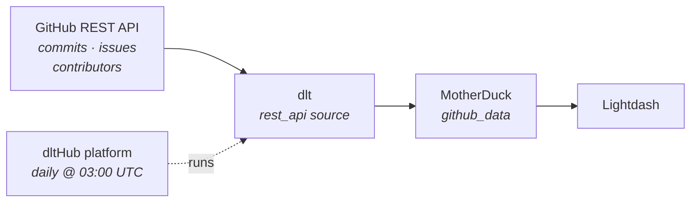

# GitHub API → MotherDuck → Lightdash

**From an empty folder to a scheduled production pipeline with a dashboard — by typing two sentences to an AI agent.**

We load commits, issues and contributors for [`dlt-hub/dlt`](https://github.com/dlt-hub/dlt) from the public **GitHub REST API** into **MotherDuck**, deploy it to the **dltHub platform** on a daily schedule, and chart it in **Lightdash**.

You will not write the pipeline. You will *ask for it.*



---

## The whole demo

```bash
uvx dlthub-init@latest github-demo && cd github-demo
claude
```

That's the only shell you touch (plus `dlthub login` before deploying — it needs a browser). **No toolkit installs, no `dlt` commands, no `pip`.** `dlthub-init` ships the `dlthub-router` skill, and the router pulls in whatever toolkit each request needs, when it needs it.

Then, two prompts — the actual sequence that produced this repo:

| # | What you type into Claude | What comes back |
|---|---------------------------|-----------------|
| 1 | `load data from github api to motherduck, no auth, endpoints: commits, issues, contributors` | a working `rest_api` pipeline, three resources, loaded and validated |
| 2 | `token added, switch to motherduck and deploy it with dlthub` | running on the dltHub platform, on a daily schedule |

Between those two the agent chained seven skills on its own: `dlthub-router` → `find-source` → `create-rest-api-pipeline` → `debug-pipeline` → `new-endpoint` → `validate-data` → `prepare-deployment` → `deploy-workspace`.

**Prerequisites:** [`uv`](https://docs.astral.sh/uv/) + Python 3.10+, [Claude Code](https://claude.com/claude-code), a [MotherDuck](https://app.motherduck.com/) token, a [dltHub](https://app.dlthub.com/) account, and [Lightdash](https://app.lightdash.cloud/) for the last step. **The data itself needs no API key** — every endpoint here is public.

---

## Step 0 — What `dlthub-init` gives you

A `uv` project with `dlt[hub]` and — the important part — the **AI harness**: rules that are always in context, named skills the agent follows instead of inventing its own path, the `dlthub-router` that installs the right toolkit on demand, and MCP tools to inspect tables, row counts and *redacted* secrets.

Without this, an agent guesses at API shapes and hallucinates dlt syntax. With it, it doesn't.

📖 [AI Harness](https://dlthub.com/docs/hub/ai-harness/introduction)

---

## Step 1 — the pipeline

You named an API, a destination, and three endpoints. The agent routes itself to the `rest-api-pipeline` toolkit, reads the [GitHub REST docs](https://docs.github.com/en/rest) instead of guessing, probes the API for what the docs gloss over — pagination lives in the `Link` response header — and writes `rest_api_pipeline.py`.

### 🎓 Four important things

1. **One endpoint first, deliberately.** The agent built `commits` alone, proved it loaded, *then* added `issues` and `contributors`. When something breaks you want one variable, not three.
2. **Pagination is one word.** `"paginator": {"type": "header_link"}` is the entire implementation.
3. **No schema anywhere.** No `CREATE TABLE`, no types. dlt infers all of it and [evolves it](https://dlthub.com/docs/general-usage/schema-evolution) when GitHub adds a field.
4. **The API's quirks are one line each.** `sha` as the key because commits have no `id`; `state: "all"` because the endpoint defaults to open issues; a `204` handler because that's what an empty repo returns.

**Credentials.** The data needs none — but MotherDuck does, and the agent operates under a hard rule: *never read `secrets.toml`, never echo a secret.* So it tells you where to put it and stops:

```toml
# .dlt/secrets.toml — gitignored, never committed
[destination.motherduck.credentials]
database = "github_demo"
password = "<your MotherDuck access token>"
```

> 🔒 if a token lands in a chat window, it is compromised — rotate it.

---

## Step 2 — the first run

The agent runs it and reads its own output (`debug-pipeline`). A dlt run is always **extract** → **normalize** → **load**.

> 🎓 **The first run went to local DuckDB, not MotherDuck.** No credentials, no account — just prove the API config is right. Only once the data looked correct did prompt 2 switch the destination, and that's a one-word change.

**The likely failure: rate limits.** Unauthenticated GitHub allows 60 requests per hour per IP, so the generated code caps how many pages it pulls per resource. Add a token to raise the ceiling to 5,000/hour, or leave the cap in and let the agent diagnose the `403` from the trace.

**Verification, not vibes.** The agent checks what actually landed: 500 commits, 500 issues, 202 contributors, plus child tables for labels, assignees and commit parents. The whole run takes about 11 seconds.

**The schema dlt inferred.** Nested objects flatten with `__` (`commit.author.date` → `commit__author__date`); nested lists become child tables (`issues.labels[]` → `issues__labels`). Nobody wrote that DDL.

> 🎓 **The GitHub trap.** *Every pull request is also an issue.* Your `issues` table contains both, and the only way to tell them apart is `pull_request__url is null`. Skip that filter and your "open issues" chart silently counts PRs too.

📖 [How dlt works](https://dlthub.com/docs/reference/explainers/how-dlt-works) · [Destination tables & lineage](https://dlthub.com/docs/general-usage/destination-tables)

---

## Step 3 — deploy and schedule

The router pulls in `dlthub-platform` and walks `setup-runtime` → `prepare-deployment` → `deploy-workspace`. Nothing for you to install.

It adds the decorator, registers the job in `__deployment__.py`, then ships it: dry-run the plan → **stops for your approval** → sync the manifest → simulate the run locally under the `prod` profile → launch on the cloud and stream logs → open the web UI.

**There is no CLI command to add a schedule.** The decorator is the source of truth, so the agent edits it and re-deploys:

```python
@run.pipeline("github_api", trigger=trigger.schedule("0 3 * * *"))  # daily at 03:00 UTC
```

Also: `trigger.every("6h")`, `trigger.once("2026-12-31T23:59:59Z")`, `trigger=other_job.success`.

> 🔑 **The one thing the agent can't do for you:** `dlthub login` opens a browser OAuth flow. Just follow the instructions.

📖 [Deployments](https://dlthub.com/docs/hub/pipeline-operations/deployments) · [Triggers](https://dlthub.com/docs/hub/pipeline-operations/triggers) · [Monitoring](https://dlthub.com/docs/hub/pipeline-operations/monitoring)

---

## Step 4 — Keep going, still by prompting

- `add pull request reviews and releases` — each new endpoint is four lines of config
- `make issues incremental on updated_at` — merge instead of full refresh
- `add a github token and load the full history` — drop the page cap
- `show me the data` · `does the loaded data look right?` · `add data quality checks on issues` · `the pipeline is slow, speed it up` · `build me a notebook with charts` · `notify me in Slack when the job fails`

📖 [Incremental loading](https://dlthub.com/docs/general-usage/incremental-loading) · [Merge loading](https://dlthub.com/docs/general-usage/merge-loading)

---

## Step 5 — Look at the data in MotherDuck

Open [app.motherduck.com](https://app.motherduck.com/) and the tables are already there, under schema **`github_data`**. The dlt `dataset_name` *is* the MotherDuck schema — that's the whole mapping.

> 🎓 **Why MotherDuck.** It's DuckDB in the cloud, so the SQL you wrote against a local `.duckdb` file works unchanged against the shared warehouse — dev → prod is a *credential* change, not a rewrite. And it's what Lightdash connects to next.

Issues and pull requests, side by side — real numbers from an actual load:

```sql
select case when pull_request__url is null then 'issue' else 'pull_request' end as kind,
       state,
       count(*) as n,
       median(date_diff('day', created_at, closed_at)) as median_days_to_close
from github_data.issues
group by 1, 2 order by 1, 2;
```

| kind | state | n | median_days_to_close |
|------|-------|--:|---------------------:|
| issue | closed | 96 | 19.0 |
| issue | open | 116 | |
| pull_request | closed | 203 | 1.0 |
| pull_request | open | 85 | |

> 🎓 Issues take ~19 days to close, PRs ~1 day. That contrast only exists *because* you split on `pull_request__url`. Without the split you'd report a blended median that looks perfectly plausible on a dashboard.

📖 [MotherDuck destination](https://dlthub.com/docs/dlt-ecosystem/destinations/motherduck) · [Access datasets in Python](https://dlthub.com/docs/general-usage/dataset-access/dataset)

---

## Step 6 — Lightdash

Lightdash builds its semantic layer from a **dbt project** and reaches MotherDuck through its **DuckDB connector in MotherDuck mode** (requires dbt **1.8+**).

**Connect:** Settings → Project → Warehouse connection → DuckDB → MotherDuck mode → your token, your database, schema `github_data`. Then add a dbt model that splits issues from PRs once, for everyone, and expose `issue_count` and `median_days_to_close` as metrics.

**Charts worth building live:** commits per week · top contributors · open issues vs open PRs as two big numbers · median days to close split by issue vs PR · label distribution.

📖 [Connect a project](https://docs.lightdash.com/get-started/setup-lightdash/connect-project) · [Metrics](https://docs.lightdash.com/references/metrics)

**Prefer to stay in Python?** dltHub can [generate the dbt models](https://dlthub.com/docs/hub/transformations/dbt-transformations) and deploy [marimo notebooks or Streamlit apps](https://dlthub.com/docs/hub/cookbook/build-streamlit-dashboard) — no BI tool required.

---

## Links

**GitHub API** — [REST docs](https://docs.github.com/en/rest) · [Pagination](https://docs.github.com/en/rest/using-the-rest-api/using-pagination-in-the-rest-api) · [Rate limits](https://docs.github.com/en/rest/using-the-rest-api/rate-limits-for-the-rest-api) · [Create a token](https://github.com/settings/tokens)

**dlt** — [Introduction](https://dlthub.com/docs/intro) · [How dlt works](https://dlthub.com/docs/reference/explainers/how-dlt-works) · [REST API source](https://dlthub.com/docs/dlt-ecosystem/verified-sources/rest_api/basic) · [Incremental](https://dlthub.com/docs/general-usage/incremental-loading) · [Credentials](https://dlthub.com/docs/general-usage/credentials) · [MotherDuck destination](https://dlthub.com/docs/dlt-ecosystem/destinations/motherduck)

**dltHub platform** — [Introduction](https://dlthub.com/docs/hub/getting-started/introduction) · [AI Harness](https://dlthub.com/docs/hub/ai-harness/introduction) · [Toolkits](https://dlthub.com/docs/hub/ai-harness/toolkits) · [Profiles](https://dlthub.com/docs/hub/pipeline-operations/profiles) · [Deployments](https://dlthub.com/docs/hub/pipeline-operations/deployments) · [Triggers](https://dlthub.com/docs/hub/pipeline-operations/triggers) · [app.dlthub.com](https://app.dlthub.com/)

**MotherDuck** — [Docs](https://motherduck.com/docs/) · [App](https://app.motherduck.com/) · [DuckDB SQL](https://duckdb.org/docs/sql/introduction)

**Lightdash** — [Docs](https://docs.lightdash.com/) · [Connect a project](https://docs.lightdash.com/get-started/setup-lightdash/connect-project) · [App](https://app.lightdash.cloud/)

**Community** — [dlt on GitHub](https://github.com/dlt-hub/dlt) · [Slack](https://dlthub.com/community) · [Blog](https://dlthub.com/blog) · [Claude Code](https://claude.com/claude-code)
