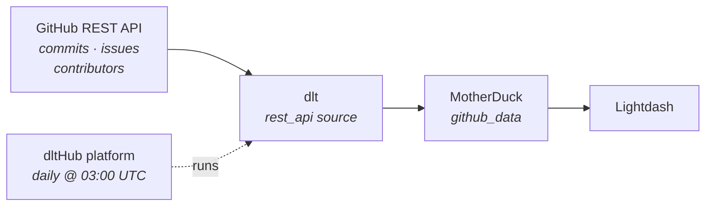

# GitHub API → MotherDuck → Lightdash

**From an empty folder to a scheduled production pipeline with a dashboard — by typing two sentences to an AI agent.**

We load commits, issues and contributors for [`dlt-hub/dlt`](https://github.com/dlt-hub/dlt) from the public **GitHub REST API** into **MotherDuck**, deploy it to the **dltHub platform** on a daily schedule, and chart it in **Lightdash**.

You will not write the pipeline. You will *ask for it.*



---

## The whole demo

```bash
uvx dlthub-init@latest github-demo && cd github-demo
claude
```

That's the only shell you touch (plus `dlthub login` before deploying — it needs a browser). **No toolkit installs, no `dlt` commands, no `pip`.** `dlthub-init` ships the `dlthub-router` skill, and the router pulls in whatever toolkit each request needs, when it needs it.

Then, two prompts — the actual sequence that produced this repo:

| # | What you type into Claude | What comes back |
|---|---------------------------|-----------------|
| 1 | `load data from github api to motherduck, no auth, endpoints: commits, issues, contributors` | a working `rest_api` pipeline, three resources, loaded and validated |
| 2 | `token added, switch to motherduck and deploy it with dlthub` | running on the dltHub platform, on a daily schedule |

Between those two the agent chained seven skills on its own: `dlthub-router` → `find-source` → `create-rest-api-pipeline` → `debug-pipeline` → `new-endpoint` → `validate-data` → `prepare-deployment` → `deploy-workspace`.

**Prerequisites:** [`uv`](https://docs.astral.sh/uv/) + Python 3.10+, [Claude Code](https://claude.com/claude-code), a [MotherDuck](https://app.motherduck.com/) token, a [dltHub](https://app.dlthub.com/) account, and [Lightdash](https://app.lightdash.cloud/) for step 7. **The data itself needs no API key** — every endpoint here is public.

---

## Step 0 — What `dlthub-init` gives you

A `uv` project with `dlt[hub]` and — the important part — the **AI harness**:

- **Rules** — always in context: *never read `secrets.toml`, always run from the project root.*
- **Skills** — named workflows: `find-source` → `create-rest-api-pipeline` → `debug-pipeline` → `validate-data` → `setup-runtime` → `prepare-deployment` → `deploy-workspace`. The agent follows the path instead of inventing one.
- **`dlthub-router`** — reads your intent and installs the right toolkit on demand.
- **MCP tools** — list tables, preview rows, check row counts, view *redacted* secrets. It can verify a token exists without ever seeing it.

Without this, an agent guesses at API shapes and hallucinates dlt syntax. With it, it doesn't.

📖 [AI Harness](https://dlthub.com/docs/hub/ai-harness/introduction)

---

## Step 1 — `load data from github api to motherduck, no auth, endpoints: ...`

You named an API, a destination, and three endpoints. The agent:

**Routes itself.** The router maps *ingest from a REST API* → `rest-api-pipeline` toolkit, installs it, enters at `find-source`.

**Reads the API instead of guessing.** It pulls the [GitHub REST docs](https://docs.github.com/en/rest) for the three endpoints you named:

| Endpoint | Key fields | What the docs say |
|----------|-----------|-------------------|
| `/repos/{owner}/{repo}/commits` | `sha`, `commit.author.date`, `commit.message`, `author.login`, `parents[]` | **no `id` field** — `sha` is the natural key |
| `/repos/{owner}/{repo}/issues` | `id`, `number`, `title`, `state`, `created_at`, `closed_at`, `labels[]`, `assignees[]` | defaults to **open issues only**; **pull requests are returned as issues** |
| `/repos/{owner}/{repo}/contributors` | `id`, `login`, `contributions` | returns **204** for an empty repository |

Then it probes what the docs gloss over and finds the pagination mechanism in a response header: `link: <https://api.github.com/repositories/.../commits?per_page=100&page=2>; rel="next"`.

**Writes the pipeline** — `rest_api_pipeline.py`, the file in this repo:

```python
@dlt.source(name="github")
def github_source(owner: str = "dlt-hub", repo: str = "dlt", access_token: Optional[str] = dlt.secrets.value):
    config: RESTAPIConfig = {
        "client": {
            "base_url": f"https://api.github.com/repos/{owner}/{repo}/",
            # public repos need no auth -- attach it only when a token is configured
            "auth": ({"type": "bearer", "token": access_token} if access_token else None),
            "headers": {"Accept": "application/vnd.github+json", "X-GitHub-Api-Version": "2022-11-28"},
            # GitHub returns next/prev/last URLs in the Link response header
            "paginator": {"type": "header_link"},
        },
        "resource_defaults": {
            "write_disposition": "replace",
            "endpoint": {"params": {"per_page": 100}},
        },
        "resources": [
            # commit objects carry no `id` field -- `sha` is the natural key
            {"name": "commits", "primary_key": "sha", "endpoint": {"path": "commits"}},
            {"name": "issues", "primary_key": "id", "endpoint": {"path": "issues", "params": {
                # the endpoint defaults to open issues only
                "state": "all", "sort": "updated", "direction": "desc",
            }}},
            {"name": "contributors", "primary_key": "id", "endpoint": {"path": "contributors",
                # 204 = empty repository, nothing to load
                "response_actions": [{"status_code": 204, "action": "ignore"}]}},
        ],
    }
    yield from rest_api_resources(config)


def load_github() -> None:
    pipeline = dlt.pipeline(
        pipeline_name="github_api",
        destination="motherduck",
        dataset_name="github_data",
    )
    # unauthenticated GitHub allows 60 requests/hour per IP, so cap the pages
    pages = dlt.config.get("pages_per_resource", int) or DEFAULT_PAGES_PER_RESOURCE
    print(pipeline.run(github_source().add_limit(pages)))


if __name__ == "__main__":
    load_github()
```

### 🎓 Four important things

1. **One endpoint first, deliberately.** The agent built `commits` alone, proved it loaded, *then* used `new-endpoint` to add `issues` and `contributors`. When something breaks you want one variable, not three.
2. **Pagination is one word.** `"paginator": {"type": "header_link"}` is the entire implementation.
3. **No schema anywhere.** No `CREATE TABLE`, no types. dlt infers all of it and [evolves it](https://dlthub.com/docs/general-usage/schema-evolution) when GitHub adds a field.
4. **Auth is optional and never hardcoded.** `access_token: Optional[str] = dlt.secrets.value` — absent, you get `None`, `auth` becomes `None`, and the pipeline runs unauthenticated. The API-shape decisions the agent made (`sha` as key, `state: "all"`, the 204 handler) are each one line of config.

**Credentials.** The data needs none — but MotherDuck does, and the agent operates under a hard rule: *never read `secrets.toml`, never echo a secret.* So it tells you where to put it and stops:

```toml
# .dlt/secrets.toml — gitignored, never committed
[destination.motherduck.credentials]
database = "github_demo"
password = "<your MotherDuck access token>"

# optional — raises GitHub's rate limit from 60 to 5,000 requests/hour
[sources.github]
access_token = "<your GitHub PAT>"
```

> 🔒 if a token lands in a chat window, it is compromised — rotate it.

---

## Step 2 — the first run

The agent runs it and reads its own output (`debug-pipeline`). A dlt run is always **extract** (page the API to disk) → **normalize** (infer types, unnest lists, write Parquet) → **load** (create tables, load them).

> 🎓 **The first run went to local DuckDB, not MotherDuck.** No credentials, no account, no network destination — just prove the API config is right. Only once the data looked correct did prompt 2 switch the destination, and `destination="duckdb"` → `destination="motherduck"` is a one-word change.

### 🎓 The likely failure: rate limits

Unauthenticated GitHub allows **60 requests per hour per IP**. Ten minutes of iterating and the API starts returning `403 rate limit exceeded` — mid-demo, in front of everyone. That is exactly why the generated code caps itself:

```toml
# .dlt/config.toml — pages (of 100 records) pulled per resource per run
pages_per_resource = 5
```

Configure a token to raise the ceiling to 5,000/hour, or leave the cap in and let the agent diagnose the 403 from the trace.

### Verification, not vibes

With `pages_per_resource = 5` the agent gets **500 commits, 500 issues, 202 contributors** — plus the child tables `commits__parents` (527), `issues__labels` (380), `issues__assignees` (273). Commits and issues hit the 5-page cap exactly; contributors stopped at 202, meaning pagination ran out first — that's everyone the API lists.

The whole run takes **about 11 seconds**.

### The schema dlt inferred

**Nested objects flatten with `__`** (`commit.author.date` → `commit__author__date`) and **nested lists become child tables** (`issues.labels[]` → `issues__labels`, linked by `_dlt_parent_id`). `issues` ended up with **149 columns**, `commits` with **61** — all inferred, nobody wrote that DDL.

> 🎓 **The GitHub trap.** *Every pull request is also an issue.* Your `issues` table contains both, and the only way to tell them apart is `pull_request__url is null`. Skip that filter and your "open issues" chart silently counts PRs too.

📖 [How dlt works](https://dlthub.com/docs/reference/explainers/how-dlt-works) · [Destination tables & lineage](https://dlthub.com/docs/general-usage/destination-tables)

---

## Step 3 — `switch to motherduck and deploy it with dlthub`

The router pulls in `dlthub-platform` and walks `setup-runtime` → `prepare-deployment` → `deploy-workspace`. Nothing for you to install.

**It adds decorator** `@run.pipeline("github_api")`.

**It registers the job** in `__deployment__.py`:

```python
from rest_api_pipeline import load_github
__all__ = ["load_github"]
```

**Then it ships it,** narrating each step: dry-run the plan → **stops for your approval** → sync the manifest (~5s) → simulate the run locally under the `prod` profile → launch on the cloud and stream logs → open the web UI.

> 🔑 **The one thing the agent can't do for you:** `dlthub login` opens a browser OAuth flow. Just follow the instructions.

📖 [Deployments](https://dlthub.com/docs/hub/pipeline-operations/deployments) · [Monitoring](https://dlthub.com/docs/hub/pipeline-operations/monitoring)

---

## Step 4 — the schedule

**There is no CLI command to add a schedule.** The decorator is the source of truth, so the agent edits it and re-deploys; the deploy reconciles everything (new jobs added, removed jobs archived).

```python
@run.pipeline("github_api", trigger=trigger.schedule("0 3 * * *"))  # daily at 03:00 UTC
```

Also: `trigger.every("6h")`, `trigger.once("2026-12-31T23:59:59Z")`, `trigger=other_job.success`.

📖 [Triggers and scheduling](https://dlthub.com/docs/hub/pipeline-operations/triggers)

---

## Step 5 — Keep going, still by prompting

**`add pull request reviews and releases`** → the agent uses `new-endpoint`, and each new resource is four lines:

```python
{"name": "releases", "primary_key": "id", "endpoint": {"path": "releases"}},
{"name": "pulls",    "primary_key": "id", "endpoint": {"path": "pulls", "params": {"state": "all"}}},
```

**`make issues incremental on updated_at`** → the resource already sorts `updated desc`, which is not an accident — it's what makes an incremental cursor cheap:

```python
{"name": "issues", "write_disposition": "merge", "primary_key": "id", "endpoint": {"path": "issues", "params": {
    "state": "all", "sort": "updated", "direction": "desc",
    "since": {"type": "incremental", "cursor_path": "updated_at", "initial_value": "2024-01-01T00:00:00Z"},
}}},
```

**`add a github token and load the full history`** → drop the `.add_limit()`, raise `pages_per_resource`, and the same pipeline pulls years instead of five pages.

Other prompts worth trying: `show me the data` · `does the loaded data look right?` · `add data quality checks on issues` · `the pipeline is slow, speed it up` · `build me a notebook with charts` · `notify me in Slack when the job fails`.

📖 [Incremental loading](https://dlthub.com/docs/general-usage/incremental-loading) · [Merge loading](https://dlthub.com/docs/general-usage/merge-loading)

---

## Step 6 — Look at the data in MotherDuck

Open [app.motherduck.com](https://app.motherduck.com/) and the tables are already there, under the database from your `secrets.toml` → schema **`github_data`**. The dlt `dataset_name` *is* the MotherDuck schema — that's the whole mapping.

> 🎓 **Why MotherDuck for a demo like this.** It's DuckDB in the cloud, so the SQL you wrote against a local `.duckdb` file works unchanged against the shared warehouse — the dev → prod switch is a *credential* change, not a rewrite. There's nothing to provision, and it's what Lightdash connects to in step 7.

Results below come from an actual load — nothing here is illustrative.

```sql
select login, contributions
from github_data.contributors
order by contributions desc
limit 5;
```

| login | contributions |
|-------|--------------:|
| rudolfix | 1,612 |
| sh-rp | 380 |
| burnash | 292 |
| steinitzu | 255 |
| TyDunn | 252 |

Issues and pull requests, side by side:

```sql
select case when pull_request__url is null then 'issue' else 'pull_request' end as kind,
       state,
       count(*) as n,
       median(date_diff('day', created_at, closed_at)) as median_days_to_close
from github_data.issues
group by 1, 2 order by 1, 2;
```

| kind | state | n | median_days_to_close |
|------|-------|--:|---------------------:|
| issue | closed | 96 | 19.0 |
| issue | open | 116 | |
| pull_request | closed | 203 | 1.0 |
| pull_request | open | 85 | |

> 🎓 Issues take ~19 days to close, PRs ~1 day. That contrast only exists *because* you split on `pull_request__url`. Without the split you'd report a blended median that looks perfectly plausible on a dashboard.

Commit activity, and label distribution:

```sql
select date_trunc('week', commit__author__date) as week,
       count(*) as commits,
       count(distinct author__login) as authors
from github_data.commits group by 1 order by 1 desc;

select l.name, count(*) as n
from github_data.issues__labels l
join github_data.issues i on l._dlt_parent_id = i._dlt_id
where i.pull_request__url is null
group by 1 order by 2 desc limit 10;
```

Or through dlt, which already knows the destination and dataset:

```python
import dlt
dataset = dlt.attach("github_api").dataset()
print(dataset.contributors.df().head())
print(dataset("select count(*) from issues where pull_request__url is null").df())
```

📖 [MotherDuck destination](https://dlthub.com/docs/dlt-ecosystem/destinations/motherduck) · [Connect from Python](https://motherduck.com/docs/getting-started/connect-query-from-python/installation-authentication/) · [Access datasets in Python](https://dlthub.com/docs/general-usage/dataset-access/dataset)

---

## Step 7 — Lightdash

Lightdash builds its semantic layer from a **dbt project** and reaches MotherDuck through its **DuckDB connector in MotherDuck mode** (requires dbt **1.8+**).

**Connect:** Settings → Project → Warehouse connection → DuckDB → MotherDuck mode → your token, your database, schema `github_data`.

**Model** — split issues from PRs once, for everyone:

```sql
-- models/fct_issues.sql
select id, number, title, state, user__login as author, created_at, closed_at,
       date_diff('day', created_at, closed_at) as days_to_close,
       pull_request__url is not null as is_pull_request
from {{ source('github_data', 'issues') }}
```

```yaml
# models/fct_issues.yml — Lightdash reads metrics from here
models:
  - name: fct_issues
    meta: {primary_key: id}
    columns:
      - name: id
        meta:
          metrics:
            issue_count: {type: count_distinct}
      - name: days_to_close
        meta:
          metrics:
            median_days_to_close: {type: median}
      - name: is_pull_request
        description: "GitHub returns PRs from the issues endpoint — always split on this"
```

**Charts worth building live:** commits per week · top contributors · open issues vs open PRs as two big numbers · median days to close split by `is_pull_request` (the chart that makes the point) · label distribution.

📖 [Connect a project](https://docs.lightdash.com/get-started/setup-lightdash/connect-project) · [Metrics](https://docs.lightdash.com/references/metrics)

**Prefer to stay in Python?** dltHub can [generate the dbt models](https://dlthub.com/docs/hub/transformations/dbt-transformations) and deploy [marimo notebooks or Streamlit apps](https://dlthub.com/docs/hub/cookbook/build-streamlit-dashboard) — no BI tool required.


## Links

**This demo** — [GitHub REST API](https://docs.github.com/en/rest) · [List commits](https://docs.github.com/en/rest/commits/commits#list-commits) · [List issues](https://docs.github.com/en/rest/issues/issues#list-repository-issues) · [List contributors](https://docs.github.com/en/rest/repos/repos#list-repository-contributors) · [Pagination](https://docs.github.com/en/rest/using-the-rest-api/using-pagination-in-the-rest-api) · [Rate limits](https://docs.github.com/en/rest/using-the-rest-api/rate-limits-for-the-rest-api) · [Create a token](https://github.com/settings/tokens)

**dlt** — [Introduction](https://dlthub.com/docs/intro) · [How dlt works](https://dlthub.com/docs/reference/explainers/how-dlt-works) · [REST API source](https://dlthub.com/docs/dlt-ecosystem/verified-sources/rest_api/basic) · [REST API tutorial](https://dlthub.com/docs/tutorial/rest-api) · [GitHub verified source](https://dlthub.com/docs/dlt-ecosystem/verified-sources/github) · [Incremental](https://dlthub.com/docs/general-usage/incremental-loading) · [Merge](https://dlthub.com/docs/general-usage/merge-loading) · [Schema evolution](https://dlthub.com/docs/general-usage/schema-evolution) · [Credentials](https://dlthub.com/docs/general-usage/credentials) · [MotherDuck destination](https://dlthub.com/docs/dlt-ecosystem/destinations/motherduck) · [Docs index for LLMs](https://dlthub.com/docs/llms.txt)

**dltHub platform** — [Introduction](https://dlthub.com/docs/hub/getting-started/introduction) · [AI Harness](https://dlthub.com/docs/hub/ai-harness/introduction) · [Toolkits](https://dlthub.com/docs/hub/ai-harness/toolkits) · [Profiles](https://dlthub.com/docs/hub/pipeline-operations/profiles) · [Deployments](https://dlthub.com/docs/hub/pipeline-operations/deployments) · [Triggers](https://dlthub.com/docs/hub/pipeline-operations/triggers) · [Monitoring](https://dlthub.com/docs/hub/pipeline-operations/monitoring) · [Data quality](https://dlthub.com/docs/hub/data-quality) · [Slack alerts](https://dlthub.com/docs/hub/notifications/slack) · [app.dlthub.com](https://app.dlthub.com/)

**MotherDuck** — [Docs](https://motherduck.com/docs/) · [App](https://app.motherduck.com/) · [DuckDB SQL](https://duckdb.org/docs/sql/introduction)

**Lightdash** — [Docs](https://docs.lightdash.com/) · [Connect a project](https://docs.lightdash.com/get-started/setup-lightdash/connect-project) · [Metrics](https://docs.lightdash.com/references/metrics) · [Self-host](https://docs.lightdash.com/self-host/self-host-lightdash) · [App](https://app.lightdash.cloud/)

**Community** — [dlt on GitHub](https://github.com/dlt-hub/dlt) · [Slack](https://dlthub.com/community) · [Blog](https://dlthub.com/blog) · [Claude Code](https://claude.com/claude-code)
