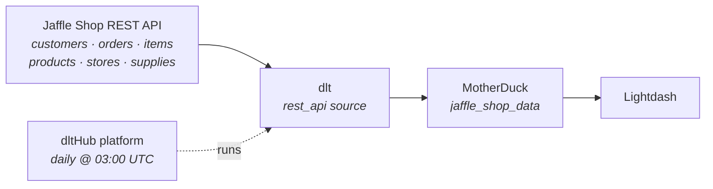

# Jaffle Shop → MotherDuck → Lightdash

**From an empty folder to a scheduled production pipeline with a dashboard — by typing four sentences to an AI agent.**

We load the [dltHub Jaffle Shop API](https://jaffle-shop.dlthub.com/docs) (a fictional toasted-sandwich chain — ~154,000 rows across six endpoints) into **MotherDuck**, deploy it to the **dltHub platform** on a daily schedule, and chart it in **Lightdash**.

You will not write the pipeline. You will *ask for it.*



---

## The whole demo

```bash
uvx dlthub-init@latest jaffle-shop && cd jaffle-shop
claude
```

That's the only shell you touch (plus `dlthub login` before deploying — it needs a browser). **No toolkit installs, no `dlt` commands, no `pip`.** `dlthub-init` ships the `dlthub-router` skill, and the router pulls in whatever toolkit each request needs, when it needs it.

Then, four prompts — the actual sequence that produced this repo:

| # | What you type into Claude | What comes back |
|---|---------------------------|-----------------|
| 1 | `load data from https://jaffle-shop.dlthub.com/docs to motherduck` | a working `rest_api` pipeline, credentials wired up |
| 2 | `token is set, run it` | ~154k rows in MotherDuck, verified against the API |
| 3 | `deploy the pipeline` | running on the dltHub platform |
| 4 | `schedule it daily` | a cron trigger |

**Prerequisites:** [`uv`](https://docs.astral.sh/uv/) + Python 3.10+, [Claude Code](https://claude.com/claude-code), a [MotherDuck](https://app.motherduck.com/) token, a [dltHub](https://app.dlthub.com/) account, and [Lightdash](https://app.lightdash.cloud/) for the last step. **The data itself needs no API key** — the Jaffle Shop API is public.

---

## Step 0 — What `dlthub-init` gives you

A `uv` project with `dlt[hub]` and — the important part — the **AI harness**: rules that are always in context, named skills the agent follows instead of inventing its own path, the `dlthub-router` that installs the right toolkit on demand, and MCP tools to inspect tables, row counts and *redacted* secrets.

Without this, an agent guesses at API shapes and hallucinates dlt syntax. With it, it doesn't.

📖 [AI Harness](https://dlthub.com/docs/hub/ai-harness/introduction)

---

## Step 1 — the pipeline

You gave it a docs URL and a destination name. The agent routes itself to the `rest-api-pipeline` toolkit, fetches the API's OpenAPI spec instead of guessing, finds six endpoints and a `/row-counts` endpoint it will later use to check its own work, probes for what the spec doesn't say — pagination lives in the `Link` response header — and writes `rest_api_pipeline.py`.

### 🎓 Three important things

1. **One endpoint first, deliberately.** The skill builds the simplest thing that loads. When something breaks you want one variable, not six.
2. **Pagination is one word.** `"paginator": "header_link"` is the entire implementation.
3. **No schema anywhere.** No `CREATE TABLE`, no types. dlt infers all of it and [evolves it](https://dlthub.com/docs/general-usage/schema-evolution) when the API changes.

**Credentials.** MotherDuck needs a token, and the agent operates under a hard rule: *never read `secrets.toml`, never echo a secret.* So it tells you where to put it and stops:

```toml
# .dlt/secrets.toml — gitignored, never committed
[destination.motherduck.credentials]
database = "jaffle_demo"
password = "<your MotherDuck access token>"
```

> 🔒 if a token lands in a chat window, it is compromised — rotate it.

---

## Step 2 — the first run

The agent runs it and reads its own output (`debug-pipeline`). A dlt run is always **extract** → **normalize** → **load**.

**The best moment: it fails.** The agent had reached for a page-number paginator, and `PageNumberPaginator.total_path` defaults to `"total"`, a field this API doesn't return. It pulled the trace and the load package, read the traceback, switched to `header_link` — which the `Link` header had been advertising all along — and re-ran. Green.

**Verification, not vibes.** The agent compares what landed against `/row-counts`: 935 customers, 61,948 orders, 90,900 items, 10 products, 6 stores, 65 supplies — 153,864 rows, all matching. Full load ~2m30s; ~15s with `.add_limit(1)` while iterating.

**The schema dlt inferred.** Nested objects flatten with `__`; nested lists become child tables — each order embeds `items[]`, so you get `orders__items` linked by `_dlt_parent_id`. Nobody wrote that DDL.

> 🎓 **Spot the redundancy.** Orders embed their items *and* there's a standalone `/items` endpoint — load both and the same 90,900 rows arrive twice. Which one would you keep? *(The standalone one is independently paginated.)*

📖 [How dlt works](https://dlthub.com/docs/reference/explainers/how-dlt-works) · [Destination tables & lineage](https://dlthub.com/docs/general-usage/destination-tables)

---

## Step 3 — deploy and schedule

The router pulls in `dlthub-platform` and walks `setup-runtime` → `prepare-deployment` → `deploy-workspace`. Nothing for you to install.

It adds the decorator, registers the job in `__deployment__.py`, then ships it: dry-run the plan → **stops for your approval** → sync the manifest → simulate the run locally under the `prod` profile → launch on the cloud and stream logs → open the web UI.

**There is no CLI command to add a schedule.** The decorator is the source of truth, so the agent edits it and re-deploys:

```python
@run.pipeline("jaffle_shop", trigger=trigger.schedule("0 3 * * *"))  # daily at 03:00 UTC
```

Also: `trigger.every("6h")`, `trigger.once("2026-12-31T23:59:59Z")`, `trigger=other_job.success`.

> 🔑 **The one thing the agent can't do for you:** `dlthub login` opens a browser OAuth flow. Just follow the instructions.

📖 [Deployments](https://dlthub.com/docs/hub/pipeline-operations/deployments) · [Triggers](https://dlthub.com/docs/hub/pipeline-operations/triggers) · [Monitoring](https://dlthub.com/docs/hub/pipeline-operations/monitoring)

---

## Step 4 — Keep going, still by prompting

- `add the remaining endpoints: orders, items, products, stores, supplies` — and watch it pick `sku` for products, which has no `id` at all
- `make orders incremental on ordered_at` — `/orders` accepts `start_date`/`end_date`, so it's built for this
- `show me the data` · `does the loaded data look right?` · `add data quality checks on orders` · `the pipeline is slow, speed it up` · `build me a notebook with charts` · `notify me in Slack when the job fails`

📖 [Incremental loading](https://dlthub.com/docs/general-usage/incremental-loading) · [Merge loading](https://dlthub.com/docs/general-usage/merge-loading)

---

## Step 5 — Look at the data in MotherDuck

Open [app.motherduck.com](https://app.motherduck.com/) and the tables are already there, under schema **`jaffle_shop_data`**. The dlt `dataset_name` *is* the MotherDuck schema — that's the whole mapping.

> 🎓 **Why MotherDuck.** It's DuckDB in the cloud, so the SQL you wrote against a local `.duckdb` file works unchanged against the shared warehouse — dev → prod is a *credential* change, not a rewrite. And it's what Lightdash connects to next.

Real numbers from an actual full load:

```sql
select s.name as store,
       count(*) as orders,
       round(sum(o.order_total) / 100.0, 2) as revenue_usd  -- the API returns cents
from jaffle_shop_data.orders o
join jaffle_shop_data.stores s on o.store_id = s.id
group by 1 order by 3 desc;
```

| store | orders | revenue_usd |
|-------|-------:|------------:|
| Philadelphia | 39,931 | 450,969.65 |
| Brooklyn | 22,017 | 220,455.72 |

> 🎓 Six stores exist in `stores`, but only **two** appear in `orders` — a join that quietly drops four dimension rows, exactly the kind of thing to notice *before* it reaches a dashboard.

The dataset covers 2016-09-01 → 2017-08-31: 61,948 orders, $671,425.37 total, $10.84 average order.

📖 [MotherDuck destination](https://dlthub.com/docs/dlt-ecosystem/destinations/motherduck) · [Access datasets in Python](https://dlthub.com/docs/general-usage/dataset-access/dataset)

---

## Step 6 — Lightdash

Lightdash builds its semantic layer from a **dbt project** and reaches MotherDuck through its **DuckDB connector in MotherDuck mode** (requires dbt **1.8+**).

**Connect:** Settings → Project → Warehouse connection → DuckDB → MotherDuck mode → your token, your database, schema `jaffle_shop_data`. Then add a dbt model that divides the cent amounts once, for everyone, and expose `total_revenue` and `average_order_value` as metrics.

**Charts worth building live:** revenue by month · revenue by store (and the four missing ones) · average order value as a big number · best sellers · jaffles vs beverages.

📖 [Connect a project](https://docs.lightdash.com/get-started/setup-lightdash/connect-project) · [Metrics](https://docs.lightdash.com/references/metrics)

**Prefer to stay in Python?** dltHub can [generate the dbt models](https://dlthub.com/docs/hub/transformations/dbt-transformations) and deploy [marimo notebooks or Streamlit apps](https://dlthub.com/docs/hub/cookbook/build-streamlit-dashboard) — no BI tool required.

---

## Links

**Jaffle Shop API** — [Docs](https://jaffle-shop.dlthub.com/docs) · [OpenAPI spec](https://jaffle-shop.dlthub.com/openapi.json) · [Source](https://github.com/dlt-hub/fast-api-jaffle-shop)

**dlt** — [Introduction](https://dlthub.com/docs/intro) · [How dlt works](https://dlthub.com/docs/reference/explainers/how-dlt-works) · [REST API source](https://dlthub.com/docs/dlt-ecosystem/verified-sources/rest_api/basic) · [Incremental](https://dlthub.com/docs/general-usage/incremental-loading) · [Credentials](https://dlthub.com/docs/general-usage/credentials) · [MotherDuck destination](https://dlthub.com/docs/dlt-ecosystem/destinations/motherduck)

**dltHub platform** — [Introduction](https://dlthub.com/docs/hub/getting-started/introduction) · [AI Harness](https://dlthub.com/docs/hub/ai-harness/introduction) · [Toolkits](https://dlthub.com/docs/hub/ai-harness/toolkits) · [Profiles](https://dlthub.com/docs/hub/pipeline-operations/profiles) · [Deployments](https://dlthub.com/docs/hub/pipeline-operations/deployments) · [Triggers](https://dlthub.com/docs/hub/pipeline-operations/triggers) · [app.dlthub.com](https://app.dlthub.com/)

**MotherDuck** — [Docs](https://motherduck.com/docs/) · [App](https://app.motherduck.com/) · [DuckDB SQL](https://duckdb.org/docs/sql/introduction)

**Lightdash** — [Docs](https://docs.lightdash.com/) · [Connect a project](https://docs.lightdash.com/get-started/setup-lightdash/connect-project) · [App](https://app.lightdash.cloud/)

**Community** — [dlt on GitHub](https://github.com/dlt-hub/dlt) · [Slack](https://dlthub.com/community) · [Blog](https://dlthub.com/blog) · [Claude Code](https://claude.com/claude-code)
